# 📦 IAF - Inbound Advisory Forecasting
> 재고 데이터를 기반으로 소진 시점을 예측하고, OMS 연동을 통해 선제적 출고 요청을 자동화하는 WMS 운영 지원 시스템

본 프로젝트는 3PL 풀필먼트 환경에서 출고 패턴이 비교적 안정적인 생필품 브랜드를 가정하고,  
고객사 SKU별 입·출고 이력과 재고 데이터를 분석하여 재고 위험도를 분류하고 OMS로 자동 연동하는 시스템입니다. 

운영자가 재고 부족을 사전에 인지하고 대응할 수 있도록 배치 기반 분석과 알림 기능을 구현했습니다.

## ✅ 기술 스택
- Java 17
- Spring Boot 4.0.2
- MyBatis
- JSP
- MariaDB

## ✅ 주요 기능
### 1️⃣ 재고 분석 배치 (02:30)

- 최근 7일 / 28일 기준 일평균 출고량 분석
- 가용 재고 기반 예상 소진일 계산
- 재고 상태 자동 분류 (SAFE / WARNING / DANGER)
- ANALYSIS_RESULT 테이블 적재
- BATCH_LOG 기록

### 2️⃣ OMS 자동 알림 발송 배치 (05:00)
- WARNING / DANGER 항목만 선별 전송
- 고객사별 OMS URL로 JSON 전송 (Spring RestClient 기반 HTTP 통신)
- 분석 배치 정상 완료 시에만 실행
- 발송 결과 및 payload DB 기록 (OMS_NOTIFICATION)

### 3️⃣ 웹 화면
- 업체별 입·출고 분석 : 기준/분석 데이터 및 조치 결과 조회
- OMS 전송 이력 : 전송 이력 조회 및 재발송 기능
- 배치 실행 이력 : 배치 실행 결과 및 오류 메시지 기간별 조회

### 웹 화면 예시

## ✅️ 기술적 고려사항
- OMS 연동을 위한 JSON payload 구조 설계 (baseDate, clientId, SKU별 alerts 포함)
- OMS 미설정 고객사 예외 분기 및 상황별 로그 레벨 구분(INFO/WARN/ERROR) 적용
- OMS 발송 배치 실행 전 분석 배치 정상 완료 여부를 BATCH_LOG 기반으로 검증하여 데이터 정합성 확보
- 발송 성공/실패 이력을 DB에 저장하여 재발송 및 장애 추적 지원

## ✅ 향후 확장 고려 사항
- 분석 배치: 클라이언트/SKU 데이터 급증 시 Spring Batch 파티셔닝으로 병렬 처리 전환 고려
- OMS 발송: 클라이언트 수 증가 시 Kafka/RabbitMQ 도입해 순차 루프를 비동기 Consumer로 전환 고려
- 스케줄러: 다중 서버 환경에서 중복 실행 방지를 위해 ShedLock 적용 고려

## ✅ 배치 프로세스 흐름

```mermaid
flowchart TD
    A([02:30 재고 분석 배치]) --> B[재고/출고 이력 조회]
    B --> C[일평균 출고량 계산\n7일 / 28일]
    C --> D{잔여일수}
    D -->|≤ 7일| E[DANGER]
    D -->|≤ 14일| F[WARNING]
    D -->|> 14일| G[SAFE]
    E & F & G --> H[(ANALYSIS_RESULT)]
    H --> I[(BATCH_LOG SUCCESS)]

    K([05:00 OMS 발송 배치]) --> L{분석 배치 SUCCESS?}
    L -->|NO| M[발송 중단]
    L -->|YES| N[고객사 목록 조회]
    N --> O{OMS URL?}
    O -->|없음| P[(SKIP)]
    O -->|있음| Q{WARNING/DANGER?}
    Q -->|없음| R[발송 생략]
    Q -->|있음| S[JSON payload 구성]
    S --> T[HTTP POST]
    T -->|성공| U[(SUCCESS)]
    T -->|실패| V[(FAIL)]
```

## ✅ ERD

 
